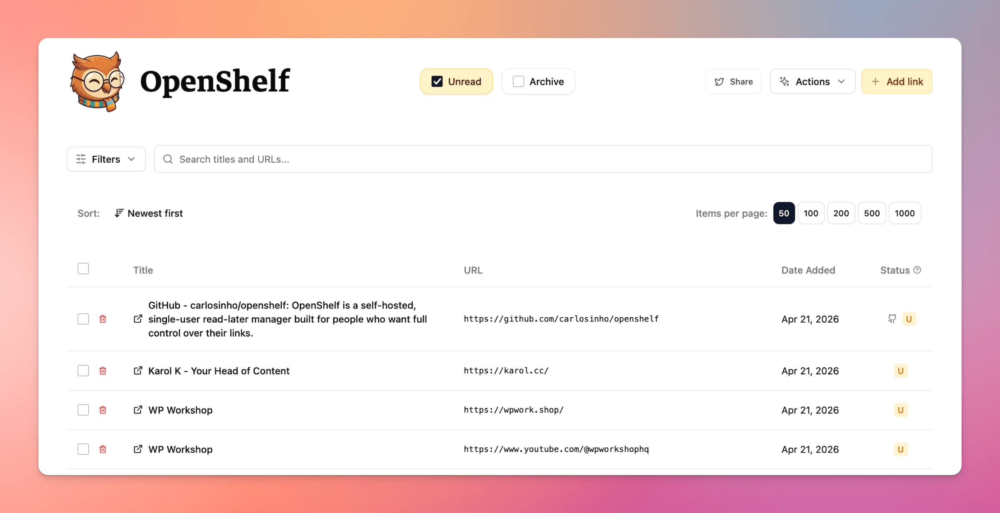

<h1 align="center">OpenShelf</h1>

<table>
  <tr>
    <td width="240" align="center" valign="top">
      
    </td>
    <td valign="middle">
      <strong>OpenShelf</strong> is a self-hosted, single-user read-later manager built for people who want full control over their links.
      <br /><br />
      It runs as a private web app on your own machine or server, stores everything in a local SQLite database, and keeps the existing OpenShelf strengths: CSV import, strong filtering, cleanup tools, manual link adding, URL checks, CSV export, and downloadable SQLite backups.
    </td>
  </tr>
</table>

<p align="center">
  
</p>

## Why It Exists

OpenShelf started as a browser-only CSV processor and has now been turned into a persistent local web app. The current implementation is for one operator who wants a private, local-first Pocket replacement without accounts, sync services, or external storage.

## What Exists Now

- Import one or more Pocket CSV export files, including later merge imports from the main library view.
- Persist links in `data/openshelf.db`.
- Protect the instance with one password and signed session cookies.
- Browse the full library with header-based unread/archive status selection, search, platform filtering for Twitter/X, Reddit, and GitHub, date filtering, homepage-only filtering, sorting, pagination, and row selection.
- Add one link manually.
- Delete one item, bulk delete selected items, or clear all archived items.
- Export all items, the current filtered view, or selected rows to CSV from the browser.
- Download a raw SQLite backup from the server.
- Run browser-side URL checks against the current filtered unread set and save `valid` or `problem` results.

## Main User Flows

### First Run

1. Start the app.
2. Log in with the instance password.
3. If the database is empty, upload one or more Pocket CSV files.
4. OpenShelf imports valid rows, skips duplicates, stores everything in SQLite, and then shows the main library view.

### Daily Use

1. Log in.
2. The app loads all items from `/api/items`.
3. Use the header unread/archive checkboxes to choose the current list view. The default view is unread-only; selecting both shows the full library and selecting neither shows an empty view. Search, filter, sort, paginate, export, and delete from the browser UI, including platform-specific filtering for Twitter/X, Reddit, and GitHub links.
4. Optionally import more Pocket CSV exports, add one URL manually, or run URL checks on the current filtered unread set.

### Export And Backup

- CSV export is generated in the browser from the currently loaded dataset.
- A raw SQLite snapshot is downloaded from `/api/backup`.

## Tech Stack

| Layer | Implementation |
| --- | --- |
| Runtime | Bun |
| API server | Hono |
| Database | SQLite via `bun:sqlite` |
| Frontend | React 18 + TypeScript |
| Build tooling | Webpack |
| Styling | Tailwind CSS |
| CSV parsing/export | Papa Parse |
| Auth | One env-configured password + signed HTTP-only cookie |

## Environment

| Variable | Required | Default | Purpose |
| --- | --- | --- | --- |
| `OPENSHELF_PASSWORD` | Yes | none | Instance password. The server refuses to start without it. |
| `PORT` | No | `3000` | Bun server port. |
| `NODE_ENV` | No | unset | `development` enables split frontend/backend dev behavior. `production` marks cookies `Secure` and enables production messaging/static behavior. |

If you set `NODE_ENV=production`, use HTTPS. The auth cookie becomes `Secure`, so plain HTTP logins will not stick.

## Install And Run

### Docker Compose

```bash
cp .env.example .env
# edit OPENSHELF_PASSWORD
docker compose up --build
```

Open `http://localhost:3000`.

Persistence:

- Host `./data` is mounted to container `/app/data`.
- The SQLite file is `data/openshelf.db`.

### Bun On The Host

```bash
cp .env.example .env
# edit OPENSHELF_PASSWORD
bun install
bun run start
```

Open `http://localhost:3000`.

`bun run start` rebuilds the frontend and then starts the Bun server.

### Development

Run the API server:

```bash
bun install
bun run dev:server
```

Run the frontend dev server in another terminal:

```bash
bun run dev:frontend
```

Development URLs:

- UI: `http://localhost:5173`
- API: `http://localhost:3000`

The webpack dev server proxies `/api/*` to `http://localhost:3000`.

## Deploy

- Production is one Bun process serving both the API and the built SPA.
- The Docker image copies `dist/`, `server/`, `node_modules/`, and `package.json`, exposes port `3000`, and declares `/app/data` as a volume.
- Static files are served from `dist/` whenever `NODE_ENV !== 'development'`.
- If you run behind a reverse proxy and want secure cookies, set `NODE_ENV=production` and terminate TLS properly.

## Project Structure

```text
server/
  index.ts            # Bun entry point and route mounting
  auth.ts             # Password auth and signed session cookie handling
  db.ts               # SQLite schema, queries, and backup serialization
  csv.ts              # Pocket CSV validation, parsing, merge, and export helpers
  routes/
    items.ts          # List, create, patch, delete, bulk-delete, clear-archived
    import.ts         # CSV import, server-side CSV export, SQLite backup
src/
  App.tsx             # Session bootstrap and top-level screen switching
  lib/api.ts          # Browser API client
  components/
    FileUpload.tsx    # Reusable CSV import UI for onboarding and later merges
    LoginForm.tsx     # Password unlock screen
    DataDisplay.tsx   # Main library UI and most operator actions
  types/pocket.ts     # Shared item type used by client and server
data/
  openshelf.db        # Created automatically at runtime
Dockerfile
docker-compose.yml
ROADMAP.md
ARCHITECTURE.md
```

## Key API Endpoints

| Method | Path | Notes |
| --- | --- | --- |
| `GET` | `/api/health` | Public health check. Returns `ok` and current item count. |
| `POST` | `/api/auth/login` | Log in with `{ "password": "..." }`. |
| `POST` | `/api/auth/logout` | Clear the current session cookie. |
| `GET` | `/api/auth/check` | Verify current session. |
| `GET` | `/api/items` | Return all saved items. |
| `POST` | `/api/items` | Add one URL. Manual adds normalize the URL and default to `unread`. |
| `PATCH` | `/api/items/:id` | Update fields such as `status`, `title`, `tags`, or validation metadata. |
| `DELETE` | `/api/items/:id` | Delete one item. |
| `POST` | `/api/items/bulk-delete` | Delete many items by `ids`. |
| `POST` | `/api/items/clear-archived` | Delete every row with `status = archive`. |
| `POST` | `/api/import` | Multipart CSV import. Field name: `files`. |
| `GET` | `/api/export?scope=all|archive|unread` | Server-side CSV export. |
| `GET` | `/api/backup` | Download a raw SQLite backup. |

The shipped UI currently uses browser-side CSV export and `GET /api/backup`. It does not call `GET /api/export`.

## Troubleshooting

- Startup fails with `OPENSHELF_PASSWORD must be set before starting OpenShelf.`  
  Set `OPENSHELF_PASSWORD` in your environment or `.env`.

- Everyone gets logged out after a restart.  
  This is expected in the current implementation. The session signing secret is generated at process startup, so restarts invalidate old cookies.

- Login works in development but fails behind a production proxy.  
  If `NODE_ENV=production`, the cookie is `Secure`. Use HTTPS end-to-end at the proxy boundary or leave `NODE_ENV` unset for plain local HTTP.

- Import reports errors but some data still appears.  
  Import is partial by design. Valid rows are inserted, bad rows are reported, and duplicates are skipped.

- Duplicate-looking links still appear.  
  Deduplication is based on exact URL strings. Manual adds normalize URLs first; imported CSV rows do not. Two URLs that look equivalent after redirects are not automatically merged unless their stored strings match.

- A manually added link is slow to save or ends up titled as the URL.  
  The server tries to fetch a page title first. If that fetch is blocked or fails, OpenShelf falls back to the normalized URL string.

- Large libraries feel heavy.  
  The current app loads all items into browser memory and applies search, filtering, sorting, pagination, and CSV export client-side.

## License

OpenShelf is available under the MIT License. See `LICENSE`.
