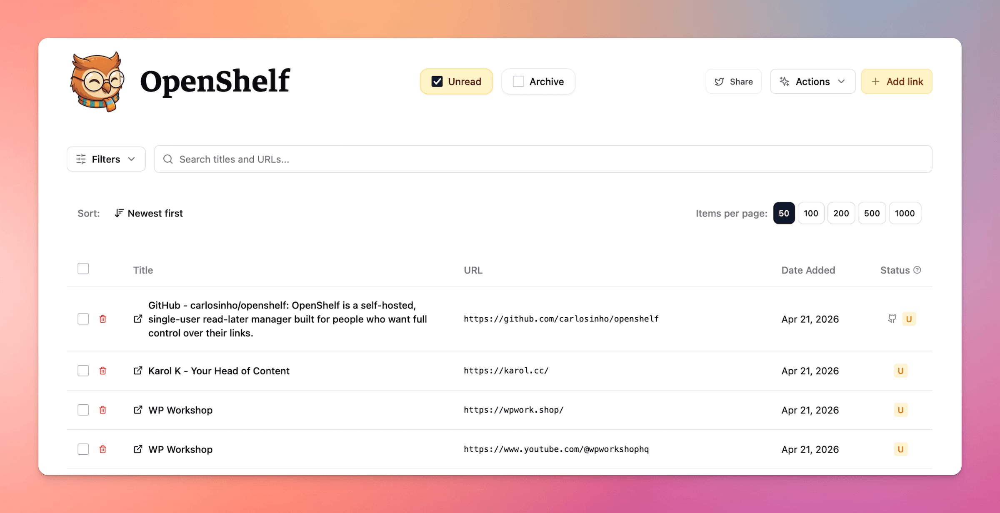

<h1 align="center">OpenShelf</h1>

<table>
  <tr>
    <td width="240" align="center" valign="top">
      
    </td>
    <td valign="middle">
      <strong>OpenShelf</strong> is a self-hosted shelf for links you want to read later.
      <br /><br />
      It is a single-user read-later manager built for people who want full control over their reading queue. 
      <br /><br />
      OpenShelf runs as a private web app, stores everything in a SQLite database, and gives you a simple workflow for adding links, organizing them into thematic shelves, filtering, archiving what you’ve read, checking URLs, cleaning up old URLs, exporting CSVs, and downloading raw database backups. It can also import compatible CSV reading lists from other tools if you already have an archive you want to bring with you.
    </td>
  </tr>
</table>

<p align="center">
  
</p>

## Why it exists

OpenShelf exists because read-later links deserve a better home than browser bookmark chaos, endless open tabs, or another hosted tool like Pocket (RIP).

It is intentionally small: one operator, private reading queue, one SQLite database, and a workflow built around saving, organizing with shelves, filtering, archiving, cleaning up, exporting, and backing up links.

It is not a hosted sync service, social bookmarking platform, team knowledge base, or generic bookmark database. It is a local-first read-later link manager you can run yourself.

## What you can do with OpenShelf

- Run a private read-later library as a small self-hosted web app.
- Store the library in `data/openshelf.db`.
- Add links manually.
- Archive, unarchive, delete links.
- Import compatible CSV files.
- Organize links into shelves.
- Filter, search, sort, archive, unarchive, and delete links.
- Run server-side URL checks on the current filtered unread set and filter down to problematic links.
- Export all items, filtered views, or selected rows to CSV.
- Download a raw SQLite backup.

## Who OpenShelf is for

OpenShelf is for people who want a private, self-hosted place to manage links they intend to read later.

It is a good fit if you:

- Prefer self-hosted tools.
- Want your reading queue stored in SQLite.
- Want a simple unread/archive workflow.
- Want to bring in your existing library from Pocket, Instapaper, Matter, or Raindrop.
- Want CSV export and raw database backups.
- Want to clean up a large backlog of saved links.
- Are comfortable running a small Dockerized web app.

## Not for / not yet

OpenShelf is intentionally simple today.

It does not currently provide:

- Hosted sync.
- Multi-user accounts.
- Team libraries.
- Browser extensions.
- Mobile apps.
- Third-party auth.
- Background workers.
- Server-side search/querying.
- Guaranteed performance for very large libraries.

If you want one private read-later queue that you run yourself, OpenShelf should fit. If you want a polished hosted platform with sync and native apps, it probably is not the right tool yet.

## Security?

- OpenShelf is designed for a trusted single-user instance.
- Anyone with the instance password can access the full library and backup.
- Use HTTPS if exposing it outside your local network.

## Main user flows

### First Login

1. Install and start the app on your machine or server.
2. Open the app in the browser and log in with the instance password from `OPENSHELF_PASSWORD`.
3. Add links manually, or import a compatible CSV if you already have a link archive.
4. OpenShelf stores everything in `data/openshelf.db` and shows the main library view.

### Daily Use

1. Log in.
2. The app loads all items from `/api/items`.
3. Use the header unread/archive checkboxes to choose the current list view. The default view is unread-only; selecting both shows the full library and selecting neither shows an empty view. Search, filter, sort, paginate, archive or unarchive items from the list or selected-items bar, export, delete, and organize with shelves from the browser UI, including platform-specific filtering for Twitter/X, Reddit, and GitHub links, custom date filtering, and quick `Date filter presets`.
4. Optionally create shelves such as `work`, `funny`, or `important`, add individual links to them, or attach an entire root domain so current and future links from that domain land on the same shelf automatically.
5. Optionally import more Pocket, Instapaper, Matter, or Raindrop CSV exports, add one URL manually, or run URL checks on the current filtered unread set.

### Export And Backup

- CSV export is generated in the browser from the currently loaded dataset.
- A raw SQLite snapshot is downloaded from `/api/backup`.

## Tech Stack

| Layer | Implementation |
| --- | --- |
| Runtime | Bun |
| API server | Hono |
| Database | SQLite via `bun:sqlite` |
| Frontend | React 18 + TypeScript |
| Build tooling | Webpack |
| Styling | Tailwind CSS |
| CSV parsing/export | Papa Parse |
| Auth | One env-configured password + signed HTTP-only cookie |

## Environment

| Variable | Required | Default | Purpose |
| --- | --- | --- | --- |
| `OPENSHELF_PASSWORD` | Yes | none | Instance password. The server refuses to start without it. |
| `NODE_ENV` | No | unset | Set `production` only when OpenShelf is served over HTTPS. In that mode the login cookie is marked `Secure`. |

The official install is the published Docker image on Docker Hub. OpenShelf listens on container port `3000` and stores its SQLite data in `/app/data`.

- Pass env vars to Docker with `docker run -e ...`. 
- For Bun-based local development, set them in your shell or prefix the Bun command inline.

## Install And Run

### Docker Hub On A Server

OpenShelf is intended to run on a server or VPS as a single Docker container.

```bash
docker run -d \
  --name openshelf \
  --restart unless-stopped \
  -p 3000:3000 \
  -e OPENSHELF_PASSWORD='replace-this-with-a-real-password' \
  -v openshelf-data:/app/data \
  carlosinho/openshelf:latest
```

Then open `http://YOUR_SERVER_IP:3000`.

If port `3000` is already used on the server, change the host side of `-p`. For example, this maps host port `8080` to the container's internal port `3000`:

```bash
docker run -d \
  --name openshelf \
  --restart unless-stopped \
  -p 8080:3000 \
  -e OPENSHELF_PASSWORD='replace-this-with-a-real-password' \
  -v openshelf-data:/app/data \
  carlosinho/openshelf:latest
```

Then open `http://YOUR_SERVER_IP:8080`.

For a public domain, put OpenShelf behind a reverse proxy such as Caddy, nginx, Traefik, or Cloudflare Tunnel. Once the app is available at an HTTPS URL, pass `NODE_ENV=production` to the container:

```bash
docker run -d \
  --name openshelf \
  --restart unless-stopped \
  -p 3000:3000 \
  -e OPENSHELF_PASSWORD='replace-this-with-a-real-password' \
  -e NODE_ENV=production \
  -v openshelf-data:/app/data \
  carlosinho/openshelf:latest
```

Do not enable `NODE_ENV=production` if you are logging in over plain `http://`, including `http://YOUR_SERVER_IP:3000`, because the browser will reject the secure login cookie on non-HTTPS pages.

Persistence:

- Docker volume `openshelf-data` is mounted to container `/app/data`.
- The SQLite file is `data/openshelf.db`.
- Keep that volume when updating the container.
- To stop or restart later, run `docker stop openshelf` or `docker restart openshelf`.

Updating:

```bash
docker pull carlosinho/openshelf:latest
docker stop openshelf
docker rm openshelf
docker run -d \
  --name openshelf \
  --restart unless-stopped \
  -p 3000:3000 \
  -e OPENSHELF_PASSWORD='replace-this-with-your-existing-password' \
  -v openshelf-data:/app/data \
  carlosinho/openshelf:latest
```

- Removing the container does not remove the named volume or the SQLite database.
- Keep the existing `openshelf-data` volume.

### Development

Run the API server:

```bash
bun install
OPENSHELF_PASSWORD=changeme bun run dev:server
```

Run the frontend dev server in another terminal:

```bash
bun run dev:frontend
```

Development URLs:

- UI: `http://localhost:5173`
- API: `http://localhost:3000`

The webpack dev server proxies `/api/*` to `http://localhost:3000`.

## Deploy

- Production is one Bun process serving both the API and the built SPA.
- The official production artifact is the Docker Hub image `carlosinho/openshelf`.
- The Docker image builds the frontend, copies `dist/`, `server/`, `node_modules/`, and `package.json`, exposes port `3000`, declares `/app/data` as a volume, and includes a healthcheck against `/api/health`.
- Static files are served from `dist/` whenever `NODE_ENV !== 'development'`.
- If you run behind a reverse proxy and want secure cookies, set `NODE_ENV=production` and terminate TLS properly.
- If `NODE_ENV=production`, logins must happen over HTTPS because the auth cookie becomes `Secure`.
- When updating a server install, pull the new image, recreate the container, and keep the existing Docker volume.

## Project Structure

```text
server/
  index.ts            # Bun entry point, route mounting, central API error fallback
  auth.ts             # Password auth and signed session cookie handling
  db.ts               # SQLite schema, queries, and backup serialization
  csv.ts              # CSV validation, parsing, merge, and export helpers
  routes/
    items.ts          # List, create, patch, URL-check, delete, bulk-delete, clear-archived
    shelves.ts        # Shelf CRUD, item assignment, and domain-rule routes
    import.ts         # CSV import, server-side CSV export, SQLite backup
src/
  App.tsx             # Session bootstrap and top-level screen switching
  lib/api.ts          # Browser API client
  lib/domain.ts       # Root-domain parsing shared by client and server
  components/
    FileUpload.tsx    # Reusable CSV import UI for onboarding and later merges
    LoginForm.tsx     # Password unlock screen
    DataDisplay.tsx   # Main library orchestrator for state, derived data, and actions
    data-display/
      ...             # Extracted DataDisplay UI sections and helpers
  types/pocket.ts     # Shared item type used by client and server
data/
  openshelf.db        # Created automatically at runtime
Dockerfile
.github/workflows/docker-publish.yml
ROADMAP.md
ARCHITECTURE.md
```

## Key API Endpoints

| Method | Path | Notes |
| --- | --- | --- |
| `GET` | `/api/health` | Public health check. Returns `ok` and current item count. |
| `POST` | `/api/auth/login` | Log in with `{ "password": "..." }`. |
| `POST` | `/api/auth/logout` | Clear the current session cookie. |
| `GET` | `/api/auth/check` | Verify current session. |
| `GET` | `/api/items` | Return all saved items. |
| `POST` | `/api/items` | Add one URL. Manual adds normalize the URL and default to `unread`. |
| `POST` | `/api/items/check-urls` | Check up to 10 unread item URLs server-side and persist `validation_status`. |
| `PATCH` | `/api/items/:id` | Update fields such as `status`, `title`, `tags`, or validation metadata. |
| `DELETE` | `/api/items/:id` | Delete one item. |
| `POST` | `/api/items/bulk-delete` | Delete many items by `ids`. |
| `POST` | `/api/items/clear-archived` | Delete every row with `status = archive`. |
| `GET` | `/api/shelves` | Return all shelves plus saved domain rules. |
| `POST` | `/api/shelves` | Create one shelf by name. |
| `PATCH` | `/api/shelves/:id` | Rename one shelf. |
| `DELETE` | `/api/shelves/:id` | Delete one shelf without deleting items. |
| `POST` | `/api/shelves/:id/items` | Add one or more item ids to a shelf. |
| `POST` | `/api/shelves/:id/domains` | Add a root-domain rule to a shelf and backfill current matches. |
| `POST` | `/api/import` | Multipart CSV import. Field name: `files`. |
| `GET` | `/api/export?scope=all|archive|unread` | Server-side CSV export. |
| `GET` | `/api/backup` | Download a raw SQLite backup. |

The shipped UI currently uses browser-side CSV export and `GET /api/backup`. It does not call `GET /api/export`.

## Troubleshooting

- Startup fails with `OPENSHELF_PASSWORD must be set before starting OpenShelf.`  
  Set `OPENSHELF_PASSWORD` in your shell environment or prefix the startup command with it, for example `OPENSHELF_PASSWORD=changeme bun run dev:server`.

- I get logged out after a restart.  
  This is expected in the current implementation. The session signing secret is generated at process startup, so restarts invalidate old cookies.

- Login works in development but fails behind a production proxy.  
  If `NODE_ENV=production`, the cookie is `Secure`. Use HTTPS end-to-end at the proxy boundary or leave `NODE_ENV` unset for plain local HTTP.

- Import reports errors but some data still appears.  
  Import is partial by design. Valid rows are inserted, bad rows are reported, and duplicates are skipped.

- Duplicate-looking links still appear.  
  Deduplication is based on exact normalized URL strings. Manual adds and CSV imports use the same basic URL normalization, but tracking parameters and redirect-equivalent URLs are not automatically merged unless their stored strings match.

- A domain shelf rule seems broader than expected.  
  Shelf rules match the root domain, so `www.example.com` and `blog.example.com` both count as `example.com`.

- A manually added link is slow to save or ends up titled as the URL.  
  The server tries to fetch a page title first. That fetch is best-effort and uses an `8` second timeout. If it times out, is blocked, or otherwise fails, OpenShelf falls back to the normalized URL string.

- URL checking marks some links as `problem` even though they open in my browser.  
  The checker runs from the server, not your browser. Some sites block or challenge server-side fetches differently than normal browser visits. OpenShelf also treats obvious Cloudflare challenge pages as non-problematic, so the result is best-effort rather than perfect.

- Large libraries feel heavy.  
  The current app loads all items into browser memory and applies search, filtering, sorting, pagination, and CSV export client-side.

## License

OpenShelf is available under the MIT License. See `LICENSE`.
